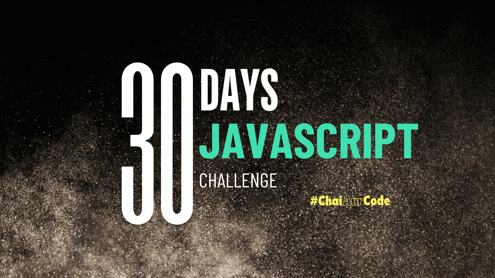

<h1 align="center">30 Days of JavaScript Challenge</h1>

  

I undertook 30 Days JavaScript Challenge by Hitesh Choudhary sir (Chai Aur Code).

I will update this repository every day till 30 days.

